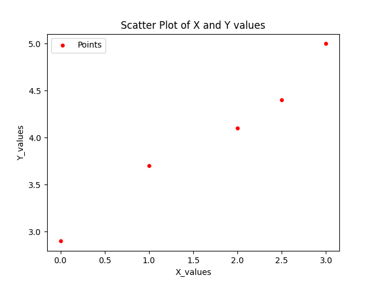
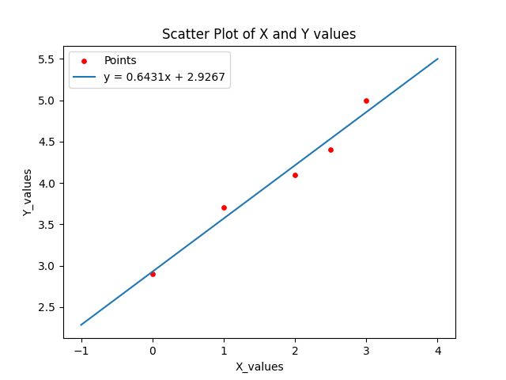

# least-square-fitting-of-straight-lines

The date used in testing the porgram: 

| x   | y   | 
|-----|-----|
| 0   | 2.9 |
| 1   | 3.7 |
| 2   | 4.1 |
| 2.5 | 4.4 |
| 3   | 5   |

The output should be a straight line on the form of :
     $`\[ y = ax + b \]`$
        Where
                a : the slope of the line
                b : the y intercept

## plot
To plot the points i used 'matplotlib' python module.
```
plt.scatter(x, y, s=15, label='Points', color='red')
plt.xlabel('X_values')
plt.ylabel('Y_values')
plt.title('Scatter Plot of X and Y values')
plt.show()
```
### Which gives us the following graph:


### Line plot:
In order to plot the line we create a list of all the valued for x in a certain domain
using 'numpy' module:
```
x_l = np.linspace(-1, 4, 400)
```
The the 'y' values are calculated using the straing line formula:
```
y_l = a * x_l + b
```
### After plotting the line we get this graph:

