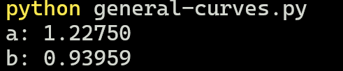

# The least square method for general curves

**The goal is to set some data points to a general curve of any form using least square method.** One way of doning this is to use `scipy.optimize` module.

The `curve_fit` function from the `scipy.optimize` module is used to fit a function to a set of data points. It utilizes nonlinear least squares to fit a model function to the data.

First we define a `model` function to define a mathematical model that represents the general curve (in our example an exponential function of the form):
```math
y = a \cdot e^{b \cdot x} + 1
```
The `a, b` are the coeffients we whish to calculate.

Then we use `curve_fit` method from `scipy` module to to find the optimal parameters of the given `model` function.

The `x, y` are experiment data points.
| x   | y    | 
|-----|------|
| 1   | 3    |
| 1.5 | 5.69 |
| 2   | 9.57 |
| 2.5 | 17.7 |
| 3   | 21.09|


**Results**


### Figuer of results:
