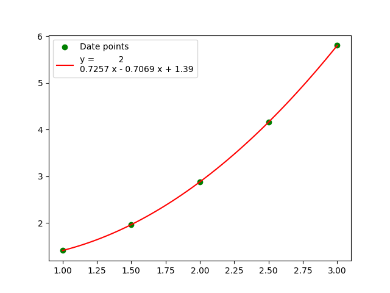

# least-square-fitting-of-polynomials

In polynomial fitting, the goal is to find a polynomial of degree 𝑚
that best fits a set of data points(x<sub>i</sub>, y<sub>i</sub>) in a least-squares sense.
To do this, we set up a system of equations where the polynomial:
```math
p(x) = c_0 + c_1 x + c_2 x^2 + \cdots + c_m x^m 
```
This equation can be written in matrix form as:
```math
A⋅c=y
```
Where:
- $A$ is the Vandermonde matrix, constructed from the *x* values.
- $c$ = $[cm, c_{m-1},…,c_1,c_0]^T$
- $y$ are the *y* data points.

Now the system is a set of linear equations that can be solved
to find coefficients $c$ that that minimize the sum of squared errors between the predicted values 
$𝑝(𝑥_𝑖)$  and the observed values $𝑦_𝑖$.

#### Vandermonde matrix
```
A = np.vander(x, N + 1)
```
- **x:** 1-D input array.
- **N:** Number of columns in the output(degree of polynomial).

The columns of the output matrix $A$ are powers of the input vector. 
The order of the powers is determined by the increasing boolean argument. 
Specifically, when increasing is False, the i-th output column is the input 
vector raised element-wise to the power of **N - i - 1**. [`numpy.vander()` Documentaion](https://numpy.org/doc/stable/reference/generated/numpy.vander.html#numpy-vander)

##### The least squares solution is obtained using:
```
coeff, resid, rank, s = np.linalg.lstsq(A, y)
```
**`linalg.lstsq(a, b)`** Computes the vector `coeff` that approximately solves the equation.
- `coeff`: the best-fit coefficients of the polynomial.
- `resid`: The sum of squared residuals.
- `rank`: many independent rows/columns the matrix has.
[`linalg.lstsq()` Documentaion](https://numpy.org/doc/stable/reference/generated/numpy.linalg.lstsq.html#numpy.linalg.lstsq)

```
polynomial = np.poly1d(coeff)
```
A one-dimensional polynomial form.
- `coef` are the polynomial’s coefficients in decreasing powers.

#### plotting the results
```
plt.scatter(x,y, color='green', label='Date points')
x_line = np.linspace(min(x), max(x), 100)
plt.plot(x_line, polynomial(x_line), color='red', label=f'y = {polynomial}')
plt.legend()
plt.show()
```

### results
**Data uesd in testing the porgram:**
| x   | y   | 
|-----|-----|
| 1   | 1.41|
| 1.5 | 1.96|
| 2   | 2.88|
| 2.5 | 4.16|
| 3   | 5.8 |

**Figuer of results:**


